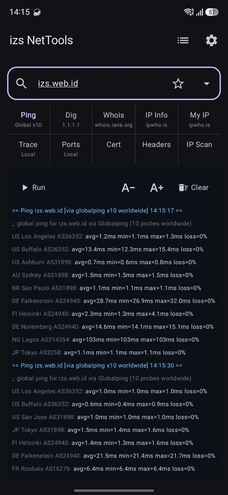

# izs NetTools

Simple but complete Android network tools. All 13 tools live on one
screen — no navigation, no fragments: a target bar on top, a two-row
tool selector in the middle (tap a tool to run it), and a terminal-style
output console below.

Package: `id.web.izs.nettools`

<p align="center">
  
</p>

## Features

| Tool      | What it does |
|-----------|--------------|
| Ping      | ICMP echo via the system `ping` binary, streamed live |
| Dig       | DNS lookup (A, AAAA, MX, TXT, NS, CNAME, SOA) via dnsjava, configurable server |
| Trace     | Traceroute: real binary if present, otherwise TTL-ping fallback (no root) |
| Whois     | RDAP-first, WHOIS port 43 with referral following |
| IP Info   | Geolocation/ASN for any IP or domain |
| My IP     | This device's current public IP |
| Ports     | TCP port scan from a configurable list (single ports + `8000-8010` ranges); open ports labeled with their service (`✓` probed live, `?` well-known fallback); hold Ports for list presets (Default / + Web / + Service / + Both / All known / Custom) |
| Cert      | TLS certificate viewer on any port — implicit TLS, STARTTLS (SMTP/IMAP/POP3/FTP) or MySQL in-band SSL — subject, issuer, validity, SANs, SHA-256, trust status |
| Headers   | HTTP response headers with redirect chain |
| IP Scan   | Parallel ping sweep of a single IP, range, or whole `/24` — lists the hosts that are up, with hostnames |
| Neighbor  | LAN device discovery over MikroTik MNDP, mDNS and UPnP/SSDP — no target needed |
| Loop      | L2 broadcast-storm check on the gateway + L3 routing-loop trace (empty target = auto gateway) |
| WiFi Analyzer | Live nearby APs re-scanned every 30 s — signal, distance, channel, bandwidth, band, security (optional 3rd row adds OUI vendor + 802.11 generation); Band/Channel/Security/Display filter tabs, List view (2/3 rows, sort) or channel-overlap view; optional SSID/MAC filter, no target needed |

Extras: saved favorites + recent targets (max configurable, default 5),
auto-run on tool pick and on saved-target pick (both toggleable), Global/Local
engine choice for Ping/Trace/Ports remembered across launches, home tool
grid order + visibility configurable in Settings → Tools (grid rows: classic
2-row split, or compact 1-row with swipe pages of 5), top-bar Hide collapses
the grid and is remembered across launches — long-press the shown tool name
for a quick switcher, semantic
output colors (toggleable, console follows light/dark theme), text size +/-, clear
output (runs append, capped at 2000 lines), 5 app themes (AMOLED, Dark, Darker, Sand,
Light gray) with per-section custom colors saved as named schemes
(same name = overwrite, new name = new scheme), double-press back to exit.

See [docs/TOOLS.md](docs/TOOLS.md) for honest backend notes and
[docs/SERVERS.md](docs/SERVERS.md) for the configurable servers.

## Stack (all latest stable, verified Sep 2026)

- Gradle 9.7.1, AGP 9.4.0 (built-in Kotlin), Kotlin (KGP) 2.4.20
- Jetpack Compose BOM 2026.09.00, Material3, activity-compose 1.13.0
- Java 17 toolchain, compileSdk 37, targetSdk 36, minSdk 26
- OkHttp 5.5.0, dnsjava 3.6.5, DataStore 1.2.1, coroutines 1.11.0,
  kotlinx-serialization 1.9.0

No KSP / Hilt / Room — deliberately, to stay on the newest Kotlin
without annotation-processing blockers. No API keys, no accounts,
no tracking.

## Quick start

```bash
./gradlew installDebug   # needs Android SDK, see docs/BUILD.md
```

Full instructions: [docs/BUILD.md](docs/BUILD.md).
Architecture overview: [docs/ARCHITECTURE.md](docs/ARCHITECTURE.md).

## License

MIT — see [LICENSE](LICENSE).
